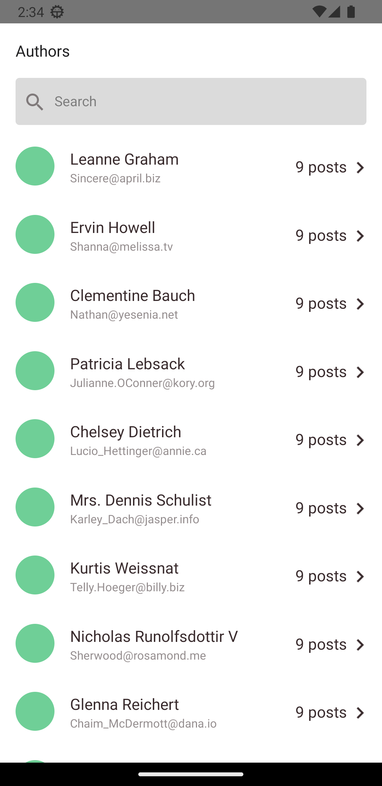
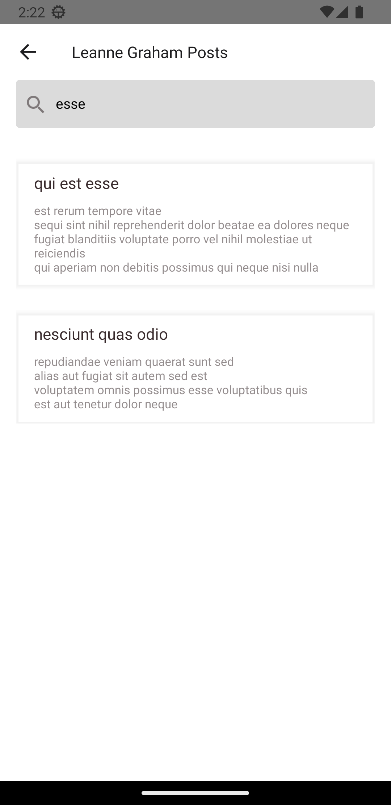

# test-task-rn

The application contains 2 screens: Authors screen. It shows a list of authors. User can search by name and email Posts screen. It Shows posts by selected Author. User can search by title and post content

### Screenshots

Figma: https://www.figma.com/file/dO5c5E0uC3K56OKDnTMXdc/Test-App?node-id=1%3A874&t=Mb2OZru5f6As9CeQ-0

Api: https://jsonplaceholder.typicode.com/posts, https://jsonplaceholder.typicode.com/users

### The test task is borrowed from this repository https://github.com/strel9/test-task-react-native
